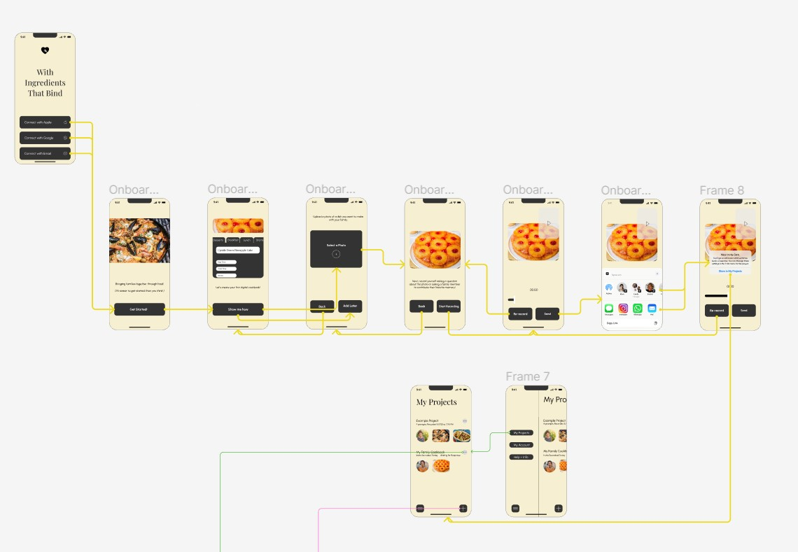
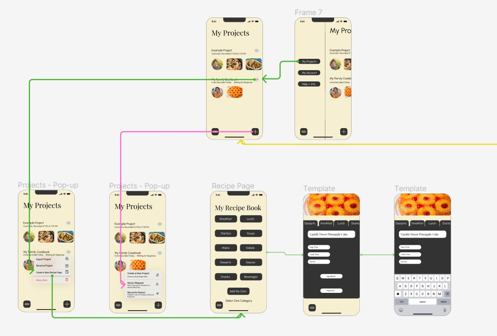
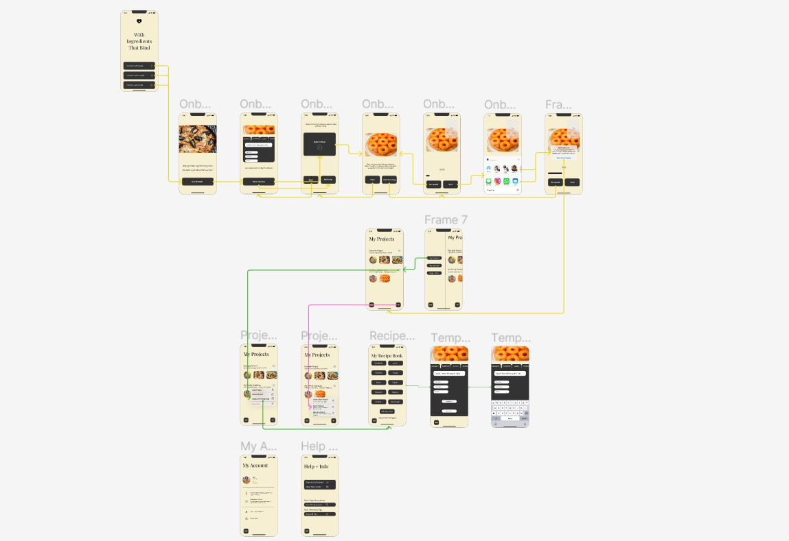
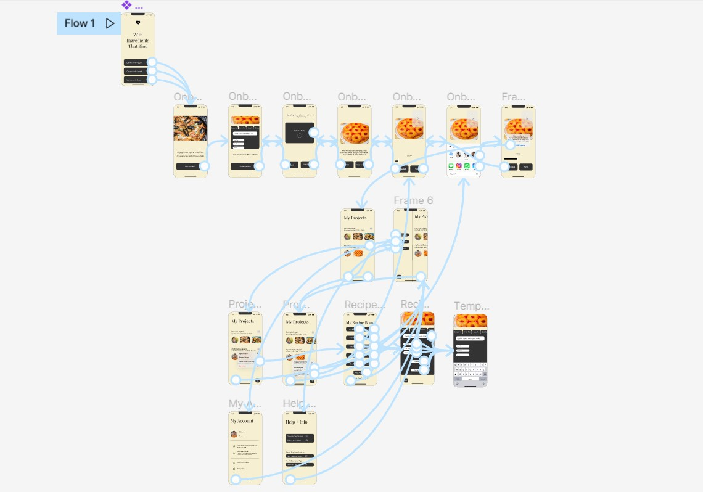

# Assignment 07:Hi-fidelity Prototype, Samantha Alexis Manuel, DH110

## Description, Purpose, + Process

The purpose of this project is to provide families with a recipe-archiving app, in other words, a digital cookbook which they can access anytime, anyplace. The app is called “With Ingredients that Bind” and it includes the option to add collaborators and use templates for recording family recipes.

The purpose and process of this hi-fi prototype is to visualize the interaction between users and their interaction with the UI elements of the application. This prototype was iterated upon the various sessions pertaining to usability, persona building, and impression testing. Wireframes were at first drafted in pencil, then digitally, and now as a high-fidelity prototype using Figma. 

## Tasks

This high-fidelity prototype supports the following tasks:

* Create a New Project (YELLOW)
* Send a Request/Add Collaborators (PURPLE)
* Fill Pre-existing Template (GREEN)

## Task Wireflow

Please find the link to the task wireflow [here](https://www.figma.com/file/4KN1fCa5r7IX7vht8ZwpEG/DH110---Assignment-07?type=design&node-id=21%3A2&t=jbRIDJrBamDLMM3X-1)

## Interactive Prototype

Please find the link to the interactive prototype [here](https://www.figma.com/file/4KN1fCa5r7IX7vht8ZwpEG/DH110---Assignment-07?type=design&node-id=21%3A2&t=jbRIDJrBamDLMM3X-1)

## Cognitive Walkthrough

Please find the link to the cognitive walkthrough data [here](https://docs.google.com/spreadsheets/d/1vCCjvBFeQ8LAnE0Frwl_nm-5mL2_8AjFPtA5njoTS30/edit?usp=sharing)

Overall, the participants understood the concept of the application. They found it easy to explore for the most part, except for the recipe page (now edited). 

## Multiple Versions + Reflections

**Prototype 1: [Paper Draft]()**

Problem: Lacking realism and limited interactivity. Overall, the lack of realism and details to the prototype makes it unclear to test participants (it requires more imagination). 

Solution: Create a digitized wireflow with an outline for the tasks needed to be completed. 

**Prototype 2: [Digitized Wireflow]()**

Problem: Better than the paper prototype but lacking in flow. Great for showing the layout of tasks, but doesn’t describe the interaction well. Some flaws in presentation as pointed out by a user. Edits were made to the hi-fidelity prototype in terms of font choice, color, and shape. 

Solution: Create a hi-fidelity prototype that takes into account the preferences of the user while employing elements of flow, engagement, and navigation.

**Prototype 3: [Task Wireflow/Hi-fi prototype]()**

Problem: Users uncovered some hiccups in the flow of the application. 

Solution: Went back and made some edits to improve the flow of the app. 
